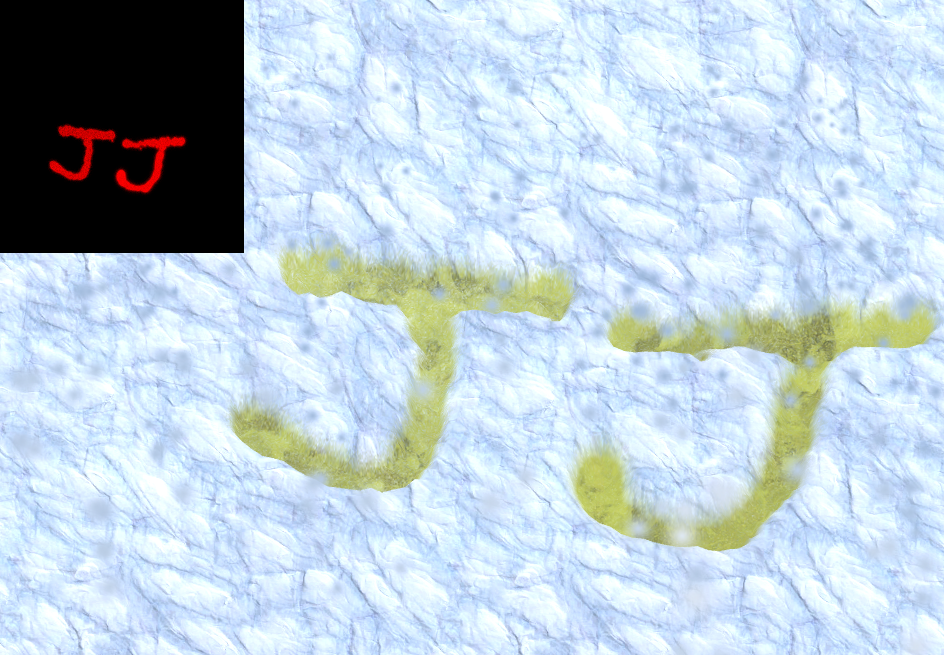

# Project Yellow Snow
Project Yellow Snow is a quick peeing in the snow simulator implemented in a weekend as an exercise in writing these kinds of shaders

# Version
Tested with Unity 2018.2.18f1 but should work with anything older.
The shaders are written using classic CG, but experimental versions for Shader graph are included as well.

# Description
The snow is drawing using [Texture splatting](https://en.wikipedia.org/wiki/Texture_splatting) and a displacement shader. A splat map is used, where
the red channel controls both the displacement, and whether it should use the snow or ice texture.

There are two shaders, one which is used to render the mesh for the ground plane to apply the splat map, and one which is used to draw on the splat map.

A SplatPainter script is used to trigger the drawing shader, and is connected to particle collisions.

# Shader graph
The ground shader seems to be working fine, but I left the code version to be compatible with older unities.
The drawing shader does not seem to work well as a graph, because as far as I can tell, the Graphics.Blit workflow doesn't work for Unlit shader graph shaders right now.. See https://forum.unity.com/threads/feedback-wanted-shader-graph.511960/page-22#post-3570057

# Shout outs
/u/snow_pee on reddit - his post inspired me to write it - https://www.reddit.com/user/snow_pee
Peer Play - snow tracks tutorial - https://www.youtube.com/watch?v=Sr2KoaKN3mU
